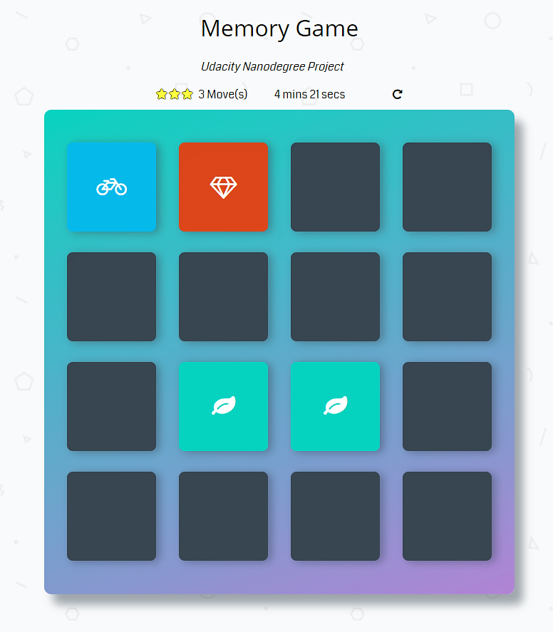

# Memory Game
Udacity Nanodegree Project (Google Scholarship)

## Dependecies
* Font-Awsome (https://maxcdn.bootstrapcdn.com/font-awesome/4.6.1/css/font-awesome.min.css);

* Google Fonts (https://fonts.googleapis.com/css?family=Coda);

* Sweet Alert v1 (https://unpkg.com/sweetalert/dist/sweetalert.min.js);

## What is this project about
This is a simple game built in Vanilla JS as part
of Udacity Nanodegree Program.

## Challenge
Match all 16 cards in less time with less moves every game.

## How to Play
Load this link in your browser https://pidjey13.github.io/MemoryGame/

## Instructions
* Click on a card
* Keep revealing cards and use your memory to remember each unveiled card.
* Match cards properly with less moves and in faster time

## How I built the Memory Game
I manipulated the DOM with Vanilla JS.
* created a deck of cards that shuffles when game is loaded or refreshed
* created a counter to count the number of moves made by player and timer to know the duration of a single game
* added effects to cards when they need to show, when they match and when they don't
* create a pop-up modal when player wins game or reload the game
